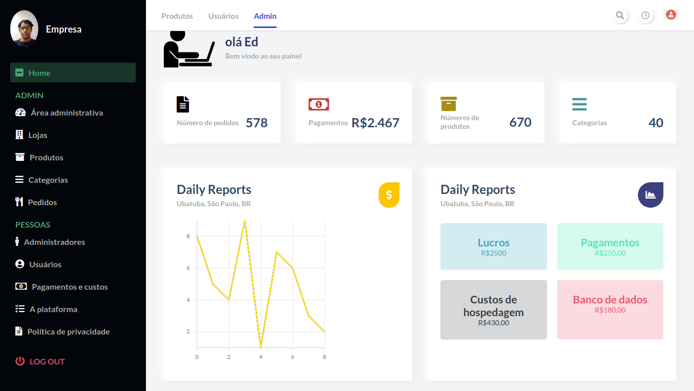
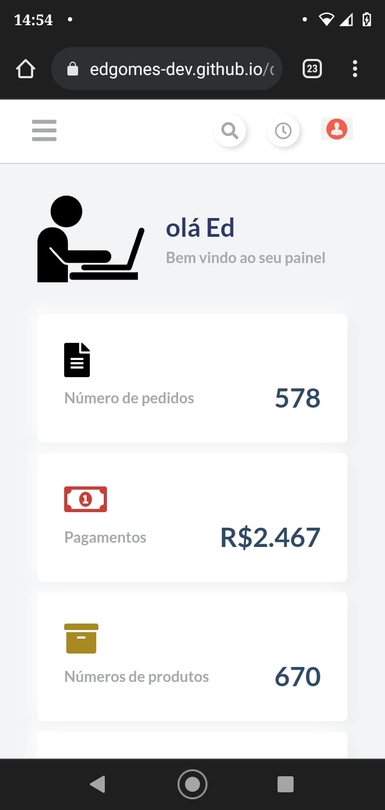

# Dashboard Administrativo

### Teste o projeto acessando o site
https://edgomes-dev.github.io/dashboard-admin/

# Layout Desktop

  

# Layout Mobile

  
  
  
  

# Sobre este  projeto
A ideia do App é:

"Apenas um página de um painél administrativo, com intuito de mostrar o layout".

# Algumas informações sobre este Website

1 - Este projeto, tem apenas a funcionalidade de mostrar o layout, não possuindo outras funcionalidades.
2 - O dados utilizados já são moldados, não tendo um backend feito para coleta dos dados.

# Funcionalidades

* Mostrar em formato de gráficos e números como está as suas financias.

# Construido com:
* React - Utilizada para fazer a construção do front-end, reaproveitando código com components e ser mais perfórmatico com renderização SPA.
* React-vis - Utilizado para fazer os gráficos da aplicação.
* gh-pages - Utilizado para colocar o site no ar com o github pages, criando uma build e subindo para o servidor com apenas um comando.
